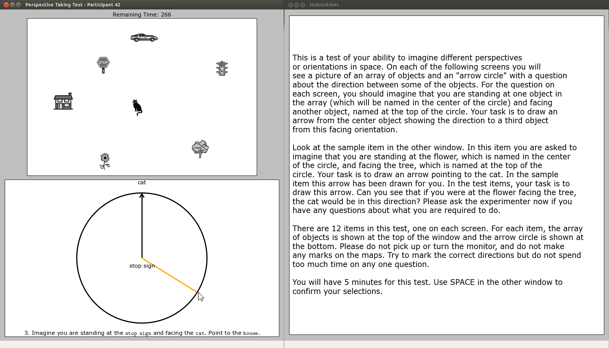

# Perspective Taking/Spatial Orientation Test
Electronic version of the "Perspective Taking/Spatial Orientation Test" by Hegarty, Kozhevnikov and Waller. It avoids
the need for measuring the participants' response angles by hand and for computing the delta angle to the correct solution. The following document hosted by the Spatial Intelligence and Learning Center served as a reference for the implementation: https://www.silc.northwestern.edu/object-perspective-spatial-orientation-test/ (accessed 10 Nov 2019).
It also mentions the two main papers the test is based on:

 * Hegarty, M., & Waller, D. (2004). A dissociation between mental rotation and perspective-taking spatial abilities. Intelligence, 32, 175-191.

 * Kozhevnikov, M., & Hegarty, M. (2001). A dissociation between object-manipulation and perspective-taking spatial abilities. Memory & Cognition, 29, 745-756.
 
## Dependencies
 * Python3 (`sudo apt-get install python3` on Debian-based systems) - http://www.python.org/
 * Matplotlib (`sudo apt-get install python3-matplotlib` on Debian-based systems) - http://matplotlib.org/
 
## Usage Instructions
The test can be run by `python3 perspective_taking_test.py`. After entering the participants ID on the console (which determines the name of the result file),
the test GUI is loaded and shows the instructions and example task, followed by the logged trials. 

The name of the output file is `results-ID.txt`, where ID is the entered participant ID. On each line, it shows the
task number, correct response angle (deg), actually logged response angle (deg) and absolute angular error (deg) in a comma-separated fashion. The last
line gives the average angular error (deg) over all 12 trials as a participant's total score.

## Screenshot

 
